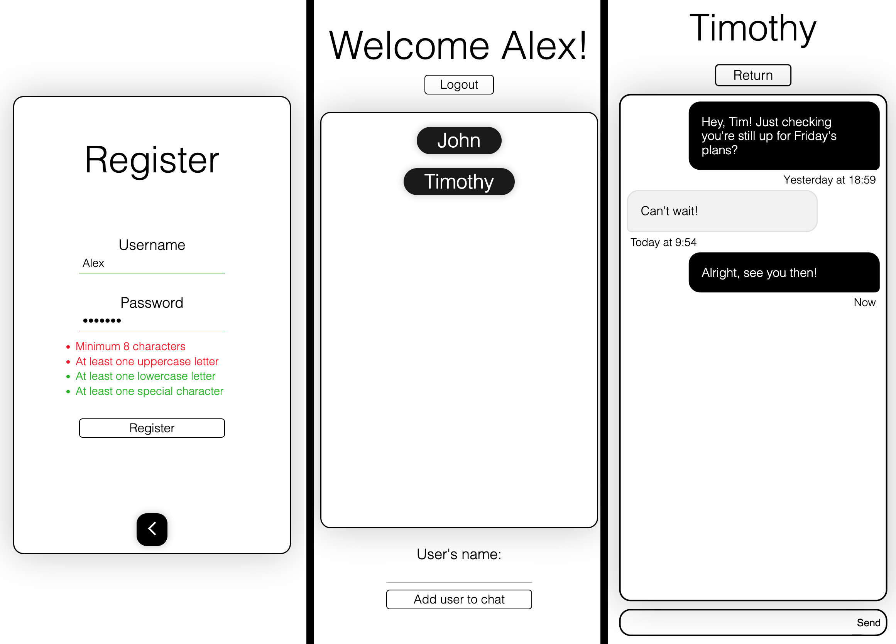

<h1>e2e-web-messenger</h1>

A self-hostable, end-to-end encrypted real-time messaging web application built with Python. Utilising WebSocket-based communication and a responsive web interface. Based off of my previous project, <a href="https://github.com/alex-pdl/senderr">Senderr</a>.

 

  

 

<h2>Running Locally</h2>

1. Download

<pre>
git clone https://github.com/alex-pdl/e2e-web-messenger.git
</pre>

2. Install Dependencies

<pre>
cd e2e-web-messenger/
pip install -r requirements.txt
</pre>

3. Run

<pre>
python3 app.py
</pre>
